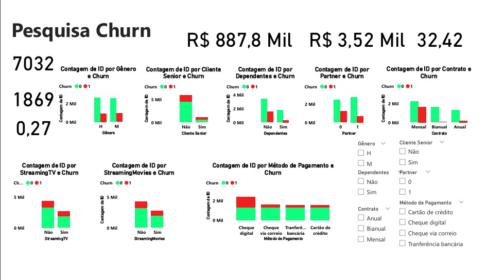

# Análise de Churn no Setor de Telecomunicações

Este projeto tem como objetivo identificar os principais fatores que levam clientes a cancelarem seus serviços (Churn) em uma empresa fictícia de telecomunicações. Através da criação de um dashboard interativo no Power BI, foram analisados aspectos contratuais, perfil dos clientes, serviços contratados e formas de pagamento.

## Objetivo do Projeto

Responder à pergunta de negócio:
**"Por que nossos clientes estão cancelando?"**

A partir disso, propor caminhos estratégicos para retenção de clientes com base nos padrões encontrados na base de dados.

## Etapas Realizadas

- Tratamento e limpeza dos dados (Python e Power BI)
- Conversão de variáveis categóricas em texto legível
- Criação de métricas como:
  - % de churn
  - Total de clientes cancelados
  - Receita total e média
  - Tempo médio de permanência
- Segmentações por perfil e comportamento
- Visualizações interativas com filtros dinâmicos

## Dashboard – Página 1

## Principais Insights

- **Contratos mensais** têm muito mais cancelamentos do que contratos anuais.
- **Pagamento por cheque digital** está altamente associado ao churn.
- **Clientes com suporte técnico, dependentes e contratos mais longos** tendem a permanecer mais.
- **Churn global** da base é de aproximadamente **26,6%**.

## Próximos Passos (Página 2 – Em construção)

- Análise financeira aprofundada:
  - Ticket médio × churn
  - Tempo de permanência médio × churn
  - Receita perdida por churn
- Predição de churn com Regressão Logística
- Regras de retenção com base em perfis de risco

## Dados Utilizados

- Dataset original: [Telco Customer Churn - Kaggle](https://www.kaggle.com/datasets/blastchar/telco-customer-churn)
- Arquivo `.pbix` incluído neste repositório

## Autor

**Diogo Amorim**  
Estudante de Ciência da Computação • Analista de Dados em formação  
[LinkedIn](https://www.linkedin.com/in/diogo-fabr%C3%ADcio-amorim-678449138)

## Observação

Este projeto representa meu processo de aprendizado e evolução com ferramentas de análise de dados e visualização. Melhorias e novas páginas serão publicadas futuramente como parte do meu portfólio.

